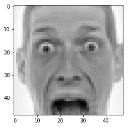

## CNN + SVM

* Here we try to examine the performance of a CNN classifier against using CNN as a feature extractor and using SVM as the final classifier. 


```python
import torch
import torch.nn as nn
import torch.nn.functional as F
from torch.utils.data import Dataset, DataLoader
import torch.optim as optim
import numpy as np
import matplotlib.pyplot as plt
import pandas as pd
```


```python
class Data:
    def __init__(self, data):
        self._x = list(data[:, 1])
        self._y = data[:, 0]
        x_len = len(self._x[0])
        for xdx, x in enumerate(self._x):
            pixels = []
            lable = None
            for idx, i in enumerate(x.split(' ')):
                pixels.append(int(i))
            pixels = np.array(pixels).reshape((1, 48, 48))
            self._x[xdx] = pixels
            self._y[xdx] = int(self._y[xdx])
        self._x = np.array(self._x).reshape((len(self._x), 1, 48, 48))
        self._y = np.array(self._y)
```


```python
class FileReader:
    def __init__(self, csv_file_name):
        self._csv_file_name = csv_file_name
    def read(self):
        data = pd.read_csv(self._csv_file_name)
        self._data = data.values
```


```python
file_reader = FileReader('fer2013/fer2013.csv')
file_reader.read()
```


```python
data = Data(file_reader._data)
```

#### Preprocess the data 


```python
data._x = np.asarray(data._x, dtype=np.float64)
data._x -= np.mean(data._x, axis = 0)
data._x /= np.std(data._x, axis = 0)
```


```python
for ix in range(10):
    plt.figure(ix)
    plt.imshow(data._x[ix].reshape((48, 48)), interpolation='none', cmap='gray')
plt.show()
```





```python
split_ratio = 0.8

train_indices = np.random.choice(len(data._x), int(len(data._x)*split_ratio))
test_indices = [i for i in range(len(data._x)) if i not in train_indices]

x_train, y_train = data._x[train_indices], data._y[train_indices]
x_valid, y_valid = data._x[test_indices], data._y[test_indices]
```

#### Implementation of CNN Architecture


```python
class CNN(nn.Module):
    def __init__(self, num_classes=7):
        super(CNN, self).__init__()

        self.layer1 = nn.Sequential(
            nn.Conv2d(1, 64, kernel_size=5),
            nn.PReLU(),
            nn.ZeroPad2d(2),
            nn.MaxPool2d(kernel_size=5, stride=2)
        )

        self.layer2 = nn.Sequential(
            nn.ZeroPad2d(padding=1),
            nn.Conv2d(64, 64, kernel_size=3),
            nn.PReLU(),
            nn.ZeroPad2d(padding=1)
        )

        self.layer3 = nn.Sequential(
            nn.Conv2d(64, 128, kernel_size=3),
            nn.PReLU(),
            nn.AvgPool2d(kernel_size=3, stride=2)
        )

        self.layer4 = nn.Sequential(
            nn.ZeroPad2d(1),
            nn.Conv2d(128, 128, kernel_size=3),
            nn.PReLU()
        )

        self.layer5 = nn.Sequential(
            nn.ZeroPad2d(1),
            nn.Conv2d(128, 128, kernel_size=3),
            nn.PReLU(),
            nn.ZeroPad2d(1),
            nn.AvgPool2d(kernel_size=3, stride=2)
        )

        self.fc1 = nn.Linear(3200, 1024)
        self.prelu = nn.PReLU()
        self.dropout = nn.Dropout(p=0.2)
        self.fc2 = nn.Linear(1024, 1024)
        self.fc3 = nn.Linear(1024, 7)
        self.log_softmax = nn.LogSoftmax(dim=1)
    def forward(self, x):

        x = self.layer1(x)
        x = self.layer2(x)
        x = self.layer3(x)
        x = self.layer4(x)
        x = self.layer5(x)

        x = x.view(x.size(0), -1)

        x = self.fc1(x)
        x = self.prelu(x)
        x = self.dropout(x)

        x = self.fc2(x)
        x = self.prelu(x)
        x = self.dropout(x)

        y = self.fc3(x)
        y = self.log_softmax(y)
        return y
```

#### Dataset for pytorch DataLoader


```python
class FER2013Dataset(Dataset):
    """FER2013 Dataset."""

    def __init__(self, X, Y, transform=None):
        """
        Args:
            csv_file (string): Path to the csv file with annotations.
            root_dir (string): Directory with all the images.
            transform (callable, optional): Optional transform to be applied
                on a sample.
        """
        self.transform = transform
        self._X = X
        self._Y = Y
        
    def __len__(self):
        return len(self._X)

    def __getitem__(self, idx):
        return {'inputs': self._X[idx], 'labels': self._Y[idx]}
```

#### Network hyperparameters 


```python
NUM_EPOCHS = 100
BATCH_SIZE = 128
LR = 0.1
MIN_LR = 0.00001
MODEL_PATH_PREFIX = 'model-cnn-epoch'
MODEL_PATH_EXT = 'pth'
device = torch.device("cuda" if torch.cuda.is_available() else "cpu")
```

#### Create the train and test loader


```python
train_set = FER2013Dataset(x_train, y_train)
test_set = FER2013Dataset(x_valid, y_valid)

train_loader = DataLoader(train_set, batch_size=BATCH_SIZE, num_workers=0, shuffle=True)
test_loader = DataLoader(test_set, batch_size=BATCH_SIZE, num_workers=0, shuffle=False)
```

#### Initialize the network and loss


```python
cnn = CNN()
cnn = cnn.to(device)
criterion = nn.CrossEntropyLoss()
optimizer = optim.Adadelta(cnn.parameters(), lr=LR, rho=0.95, eps=1e-08)
```

#### Train the network


```python
def train(model, dataset_loader, epoch, device, optimizer, criterion):
    model.train()
    running_loss = 0.0
    for i , data in enumerate(dataset_loader, 0):
        inputs, labels = data['inputs'], data['labels']
        inputs = inputs.float()
        inputs, labels = inputs.to(device), labels.to(device)
        optimizer.zero_grad()
        
        outputs = model(inputs)
        loss = criterion(outputs, labels)
        
        loss.backward()
        
        optimizer.step()
        
        running_loss += loss.item()
        
        print('Train: [Epoch: {}/{}, Batch: {} ({:.0f}%), running_loss: {:.3f}]'
              .format(
                  epoch,
                  NUM_EPOCHS,
                  i + 1, 
                  i*100/len(train_loader),
                  running_loss
              ), end='\r')
    print()
    return running_loss

def test(model, dataset_loader, device, criterion):
    model.eval()
    correct = 0
    total = 0
    valid_loss = 0
    
    with torch.no_grad():
        for data in dataset_loader:
            
            images, labels = data['inputs'], data['labels']
            images = images.float()
            images, labels = images.to(device), labels.to(device)
            
            outputs = model(images)
            valid_loss += criterion(outputs, labels).item()
            
            pred = outputs.max(1, keepdim=True)[1]
            correct += pred.eq(labels.view_as(pred)).sum().item()
    
    accuracy = 100 * correct / len(test_loader.dataset)
    print('Validation: [running loss: {:.3f}, accuracy: {:.3f}]'.format(
            valid_loss, accuracy
        )
    )
    print()
    return valid_loss, accuracy

def load_model(epoch):
    
    model = CNN()
    model.load_state_dict(torch.load('{}-{}.{}'.format(MODEL_PATH_PREFIX,str(epoch), MODEL_PATH_EXT)))
    return model

def restart_training(best_model, learning_rate, optimizer):
    model = load_model(epoch)
    for param_group in optimizer.param_groups:
        param_group['lr'] = learning_rate
    return model, optimizer
```


```python
loss_es = []
best_accuracy = 0.0
last_acc = 0
best_model = -1
```


```python
count_acc = 0
epoch = 1
while epoch <= NUM_EPOCHS:
    running_loss = train(cnn, train_loader, epoch, device, optimizer, criterion)
    valid_loss, accuracy = test(cnn, test_loader, device, criterion)
    
    # record all the models that we have had so far.
    loss_es.append((running_loss, valid_loss, accuracy))
    # write model to disk.
    torch.save(cnn.state_dict(), 'model-cnn-epoch-{}.pth'.format(epoch))
    
    # reset if:
    #   1. the accuracy is less than the best accuracy so far
    #   2. the accuracy is equal to the best accuracy so far.
    
    if accuracy < best_accuracy or int(accuracy) == int(best_accuracy):
        count_acc += 1
    
    if count_acc == 5:
        if LR/2 < MIN_LR:
            # END TRAINING.
            break
        else:
            LR/=2
        print(
            'Plateau identified: Restarting with the best model: {} and resuced learning rate: {}.'
            .format(best_model, LR)
        )
        cnn, optimizer = restart_training(best_model, LR, optimizer)
        cnn.to(device)
        count_acc = 0
        epoch = best_model
    
    if accuracy > best_accuracy:
        best_accuracy = accuracy
        best_model = epoch
        print('Best Accuracy: {}'.format(best_accuracy))
    
    epoch+=1
    
print('Trainig complete')
```

    Train: [Epoch: 1/100, Batch: 225 (100%), running_loss: 410.068]
    Validation: [running loss: 224.207, accuracy: 25.155]
    
    Best Accuracy: 25.155086848635236
    Train: [Epoch: 2/100, Batch: 225 (100%), running_loss: 393.918]
    Validation: [running loss: 220.234, accuracy: 25.633]
    
    Best Accuracy: 25.632754342431763
    Train: [Epoch: 3/100, Batch: 225 (100%), running_loss: 382.042]
    Validation: [running loss: 213.175, accuracy: 33.579]
    
    Best Accuracy: 33.57940446650124
    Train: [Epoch: 4/100, Batch: 118 (52%), running_loss: 195.688]
