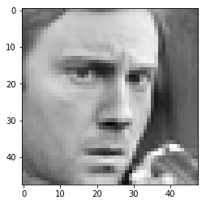
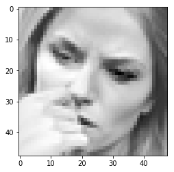
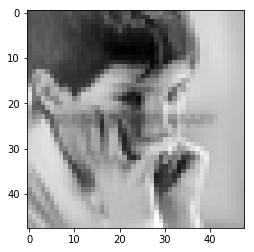
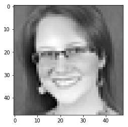
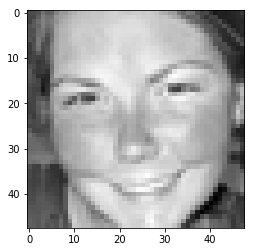

## CNN + SVM

* Here we try to examine the performance of a CNN classifier against using CNN as a feature extractor and using SVM as the final classifier. 


```python
import torch
import torch.nn as nn
import torch.nn.functional as F
from torch.utils.data import Dataset, DataLoader
import torch.optim as optim
import numpy as np
import matplotlib.pyplot as plt
import pandas as pd
```


```python
class FileReader:
    def __init__(self, csv_file_name):
        self._csv_file_name = csv_file_name
    def read(self):
        self._data = pd.read_csv(self._csv_file_name)
```


```python
file_reader = FileReader('fer2013/fer2013.csv')
file_reader.read()
```


```python
columns = file_reader._data.columns.values
classes = sorted(file_reader._data['emotion'].unique())
distribution = file_reader._data.groupby('Usage')['emotion'].value_counts().to_dict()
```


```python
# Trainig Instances
plt.bar(classes, [distribution[('Training', i)] for i in classes])
plt.xlabel('Emotions', fontsize=15)
plt.ylabel('# of instances', fontsize=15)
plt.xticks(classes, classes, fontsize=10)
plt.title('Training')
plt.show()

# Development instances
plt.bar(classes, [distribution[('PublicTest', i)] for i in classes])
plt.xlabel('Emotions', fontsize=15)
plt.ylabel('# of instances', fontsize=15)
plt.xticks(classes, classes, fontsize=10)
plt.title('Public Test')
plt.show()

# Validation Instances

plt.bar(classes, [distribution[('PrivateTest', i)] for i in classes])
plt.xlabel('Emotions', fontsize=15)
plt.ylabel('# of instances', fontsize=15)
plt.xticks(classes, classes, fontsize=10)
plt.title('Private Test')
plt.show()
```


This shows a severe class imbalance with the __highest concentration__ of training instances at class 3 and the lowest at class 1.

#### Utility class for supplying train, dev and validation data


```python
class Data:
    """
        Initialize the Data utility.
        :param data:
                    a pandas DataFrame containing data from the 
                    FER2013 dataset.
        :type file_path:
                    DataFrame
        class variables:
        _x_train, _y_train:
                    Training data and corresopnding labels
        _x_test, _y_test:
                    Testing data and corresopnding labels
        _x_valid, _y_validation:
                    Validation/Development data and corresopnding labels

    """
    def __init__(self, data):
        self._x_train, self._y_train = [],  []
        self._x_test, self._y_test = [], []
        self._x_valid, self._y_valid = [], []
        
        for xdx, x in enumerate(data.values):
            pixels = []
            label = None
            for idx, i in enumerate(x[1].split(' ')):
                pixels.append(int(i))
            pixels = np.array(pixels).reshape((1, 48, 48))
            
            if x[2] == 'Training':
                self._x_train.append(pixels)
                self._y_train.append(int(x[0]))
            elif x[2] == 'PublicTest':
                self._x_test.append(pixels)
                self._y_test.append(int(x[0]))
            else:
                self._x_valid.append(pixels)
                self._y_valid.append(int(x[0]))
        self._x_train, self._y_train = np.array(self._x_train).reshape((len(self._x_train), 1, 48, 48)),\
            np.array(self._y_train, dtype=np.int64)
        self._x_test, self._y_test = np.array(self._x_test).reshape((len(self._x_test), 1, 48, 48)),\
            np.array(self._y_test, dtype=np.int64)
        self._x_valid, self._y_valid = np.array(self._x_valid).reshape((len(self._x_valid), 1, 48, 48)),\
            np.array(self._y_valid, dtype=np.int64)
```


```python
data = Data(file_reader._data)
```

#### Preprocess the data 


```python
data._x_train = np.asarray(data._x_train, dtype=np.float64)
data._x_train -= np.mean(data._x_train, axis = 0)
data._x_train /= np.std(data._x_train, axis = 0)
```


```python
for ix in range(10):
    plt.figure(ix)
    plt.imshow(data._x_train[ix].reshape((48, 48)), interpolation='none', cmap='gray')
plt.show()
```

















#### Implementation of CNN Architecture


```python
class CNN(nn.Module):
    def __init__(self, num_classes=7):
        super(CNN, self).__init__()

        self.layer1 = nn.Sequential(
            nn.Conv2d(1, 64, kernel_size=5),
            nn.PReLU(),
            nn.ZeroPad2d(2),
            nn.MaxPool2d(kernel_size=5, stride=2)
        )

        self.layer2 = nn.Sequential(
            nn.ZeroPad2d(padding=1),
            nn.Conv2d(64, 64, kernel_size=3),
            nn.PReLU(),
            nn.ZeroPad2d(padding=1)
        )

        self.layer3 = nn.Sequential(
            nn.Conv2d(64, 128, kernel_size=3),
            nn.PReLU(),
            nn.AvgPool2d(kernel_size=3, stride=2)
        )

        self.layer4 = nn.Sequential(
            nn.ZeroPad2d(1),
            nn.Conv2d(128, 128, kernel_size=3),
            nn.PReLU()
        )

        self.layer5 = nn.Sequential(
            nn.ZeroPad2d(1),
            nn.Conv2d(128, 128, kernel_size=3),
            nn.PReLU(),
            nn.ZeroPad2d(1),
            nn.AvgPool2d(kernel_size=3, stride=2)
        )

        self.fc1 = nn.Linear(3200, 1024)
        self.prelu = nn.PReLU()
        self.dropout = nn.Dropout(p=0.2)
        self.fc2 = nn.Linear(1024, 1024)
        self.fc3 = nn.Linear(1024, 7)
        self.log_softmax = nn.LogSoftmax(dim=1)
    def forward(self, x):

        x = self.layer1(x)
        x = self.layer2(x)
        x = self.layer3(x)
        x = self.layer4(x)
        x = self.layer5(x)

        x = x.view(x.size(0), -1)

        x = self.fc1(x)
        x = self.prelu(x)
        x = self.dropout(x)

        x = self.fc2(x)
        x = self.prelu(x)
        x = self.dropout(x)

        y = self.fc3(x)
        y = self.log_softmax(y)
        return y
```

#### Dataset for pytorch DataLoader


```python
class FER2013Dataset(Dataset):
    """FER2013 Dataset."""

    def __init__(self, X, Y, transform=None):
        """
        Args:
            csv_file (string): Path to the csv file with annotations.
            root_dir (string): Directory with all the images.
            transform (callable, optional): Optional transform to be applied
                on a sample.
        """
        self.transform = transform
        self._X = X
        self._Y = Y
        
    def __len__(self):
        return len(self._X)

    def __getitem__(self, idx):
        return {'inputs': self._X[idx], 'labels': self._Y[idx]}
```

#### Network hyperparameters 


```python
NUM_EPOCHS = 100
BATCH_SIZE = 128
LR = 0.1
MIN_LR = 0.0000001
MODEL_PATH_PREFIX = 'model-cnn-epoch'
MODEL_PATH_EXT = 'pth'
device = torch.device("cuda" if torch.cuda.is_available() else "cpu")
```

#### Create the train and test loader


```python
train_set = FER2013Dataset(data._x_train, data._y_train)
test_set = FER2013Dataset(data._x_valid, data._y_valid)

train_loader = DataLoader(train_set, batch_size=BATCH_SIZE, num_workers=0, shuffle=True)
test_loader = DataLoader(test_set, batch_size=BATCH_SIZE, num_workers=0, shuffle=False)
```

#### Train the network


```python
def train(model, dataset_loader, epoch, device, optimizer, criterion):
    model.train()
    running_loss = 0.0
    for i , data in enumerate(dataset_loader, 0):
        inputs, labels = data['inputs'], data['labels']
        inputs = inputs.float()
        inputs, labels = inputs.to(device), labels.to(device)
        optimizer.zero_grad()
        
        outputs = model(inputs)
        loss = F.nll_loss(outputs, labels)
        
        loss.backward()
        
        optimizer.step()
        
        running_loss += loss.item()
        
        print('Train: [Epoch: {}/{}, Batch: {} ({:.0f}%), running_loss: {:.3f}]'
              .format(
                  epoch,
                  NUM_EPOCHS,
                  i + 1, 
                  i*100/len(train_loader),
                  running_loss
              ), end='\r')
    print()
    return running_loss

def test(model, dataset_loader, device, criterion):
    model.eval()
    correct = 0
    total = 0
    valid_loss = 0
    
    with torch.no_grad():
        for data in dataset_loader:
            
            images, labels = data['inputs'], data['labels']
            images = images.float()
            images, labels = images.to(device), labels.to(device)
            
            outputs = model(images)
            valid_loss += F.nll_loss(outputs, labels).item()
            
            pred = outputs.max(1, keepdim=True)[1]
            correct += pred.eq(labels.view_as(pred)).sum().item()
    
    accuracy = 100 * correct / len(test_loader.dataset)
    print('Validation: [running loss: {:.3f}, accuracy: {:.3f}]'.format(
            valid_loss, accuracy
        )
    )
    print()
    return valid_loss, accuracy

def load_model(best_model, learning_rate, device):
    checkpoint = torch.load(
        '{}-{}.{}'.format(
            MODEL_PATH_PREFIX,str(best_model), MODEL_PATH_EXT
        )
    )
    
    model = CNN()
    model.load_state_dict(checkpoint['model'])
    model.to(device)
    
    optimizer = optim.Adadelta(model.parameters(), lr=learning_rate, rho=0.95, eps=1e-08)
    optimizer.load_state_dict(checkpoint['optimizer'])
    
    for state in optimizer.state.values():
        for k, v in state.items():
            if torch.is_tensor(v):
                state[k] = v.to(device)
    return model, optimizer

def restart_training(best_model, learning_rate, device):
    model, optimizer = load_model(best_model, learning_rate, device)
    return model, optimizer
```

#### Initialize the network and loss


```python
cnn = CNN()
cnn = cnn.to(device)
criterion = nn.CrossEntropyLoss()
optimizer = optim.Adadelta(cnn.parameters(), lr=LR, rho=0.95, eps=1e-08)
```


```python
loss_es = []
best_accuracy = 0.0
last_acc = 0
best_model = -1
```


```python
count_acc = 0
epoch = 1
while epoch <= NUM_EPOCHS:
    running_loss = train(cnn, train_loader, epoch, device, optimizer, criterion)
    valid_loss, accuracy = test(cnn, test_loader, device, criterion)
    
    # record all the models that we have had so far.
    loss_es.append((running_loss, valid_loss, accuracy))
    # write model to disk.
    
    state = {
        'model': cnn.state_dict(),
        'optimizer': optimizer.state_dict()
    }
    torch.save(state, 'model-cnn-epoch-{}.pth'.format(epoch))
    
    # reset if:
    #   1. the accuracy is less than the best accuracy so far
    #   2. the accuracy is equal to the best accuracy so far.
    if accuracy < best_accuracy or int(accuracy) == int(best_accuracy):
        count_acc += 1
    if accuracy > best_accuracy:
        best_accuracy = accuracy
        best_model = epoch
        print('Best Accuracy: {}'.format(best_accuracy))
    if count_acc == 5:
        if LR/4 < MIN_LR:
            # END TRAINING.
            break
        else:
            LR/=4
        print(
            'Plateau identified: Restarting with the best model: {} and reduced learning rate: {}.'
            .format(best_model, LR)
        )
        cnn, optimizer = restart_training(best_model, LR, device)
        # transfer everything back to the cuda cores.
        
        count_acc = 0
        epoch = best_model
    epoch+=1
    
print('Trainig complete')
```

    Train: [Epoch: 1/100, Batch: 225 (100%), running_loss: 411.331]
    Validation: [running loss: 682.059, accuracy: 24.547]
    
    Best Accuracy: 24.547227640011144
    Train: [Epoch: 2/100, Batch: 225 (100%), running_loss: 393.070]
    Validation: [running loss: 785.302, accuracy: 18.919]
    
    Train: [Epoch: 3/100, Batch: 225 (100%), running_loss: 379.651]
    Validation: [running loss: 832.948, accuracy: 26.943]
    
    Best Accuracy: 26.94343828364447
    Train: [Epoch: 4/100, Batch: 225 (100%), running_loss: 368.468]
    Validation: [running loss: 844.496, accuracy: 25.773]
    
    Train: [Epoch: 5/100, Batch: 225 (100%), running_loss: 361.128]
    Validation: [running loss: 296.481, accuracy: 32.850]
    
    Best Accuracy: 32.85037614934522
    Train: [Epoch: 6/100, Batch: 225 (100%), running_loss: 354.128]
    Validation: [running loss: 387.085, accuracy: 32.377]
    
    Train: [Epoch: 7/100, Batch: 225 (100%), running_loss: 347.839]
    Validation: [running loss: 377.860, accuracy: 32.321]
    
    Train: [Epoch: 8/100, Batch: 225 (100%), running_loss: 342.291]
    Validation: [running loss: 360.651, accuracy: 33.519]
    
    Best Accuracy: 33.51908609640569
    Train: [Epoch: 9/100, Batch: 225 (100%), running_loss: 336.340]
    Validation: [running loss: 798.802, accuracy: 27.584]
    
    Plateau identified: Restarting with the best model: 8 and reduced learning rate: 0.025.
    Train: [Epoch: 9/100, Batch: 225 (100%), running_loss: 336.920]
    Validation: [running loss: 568.589, accuracy: 29.590]
    
    Train: [Epoch: 10/100, Batch: 225 (100%), running_loss: 331.242]
    Validation: [running loss: 961.558, accuracy: 26.386]
    
    Train: [Epoch: 11/100, Batch: 225 (100%), running_loss: 325.886]
    Validation: [running loss: 810.483, accuracy: 27.334]
    
    Train: [Epoch: 12/100, Batch: 225 (100%), running_loss: 321.701]
    Validation: [running loss: 775.532, accuracy: 27.166]
    
    Train: [Epoch: 13/100, Batch: 225 (100%), running_loss: 317.091]
    Validation: [running loss: 742.335, accuracy: 30.789]
    
    Plateau identified: Restarting with the best model: 8 and reduced learning rate: 0.00625.
    Train: [Epoch: 9/100, Batch: 225 (100%), running_loss: 336.522]
    Validation: [running loss: 408.730, accuracy: 28.448]
    
    Train: [Epoch: 10/100, Batch: 225 (100%), running_loss: 331.415]
    Validation: [running loss: 1222.410, accuracy: 20.563]
    
    Train: [Epoch: 11/100, Batch: 225 (100%), running_loss: 325.918]
    Validation: [running loss: 431.517, accuracy: 34.076]
    
    Best Accuracy: 34.07634438562273
    Train: [Epoch: 12/100, Batch: 225 (100%), running_loss: 321.169]
    Validation: [running loss: 716.688, accuracy: 26.553]
    
    Train: [Epoch: 13/100, Batch: 225 (100%), running_loss: 316.974]
    Validation: [running loss: 598.868, accuracy: 35.414]
    
    Best Accuracy: 35.41376427974366
    Train: [Epoch: 14/100, Batch: 225 (100%), running_loss: 311.818]
    Validation: [running loss: 628.053, accuracy: 31.819]
    
    Train: [Epoch: 15/100, Batch: 225 (100%), running_loss: 307.407]
    Validation: [running loss: 591.430, accuracy: 33.937]
    
    Plateau identified: Restarting with the best model: 13 and reduced learning rate: 0.0015625.
    Train: [Epoch: 14/100, Batch: 225 (100%), running_loss: 312.710]
    Validation: [running loss: 475.318, accuracy: 33.185]
    
    Train: [Epoch: 15/100, Batch: 225 (100%), running_loss: 308.469]
    Validation: [running loss: 854.844, accuracy: 34.076]
    
    Train: [Epoch: 16/100, Batch: 225 (100%), running_loss: 304.180]
    Validation: [running loss: 1025.908, accuracy: 34.801]
    
    Train: [Epoch: 17/100, Batch: 225 (100%), running_loss: 299.108]
    Validation: [running loss: 1203.669, accuracy: 31.597]
    
    Train: [Epoch: 18/100, Batch: 225 (100%), running_loss: 295.814]
    Validation: [running loss: 742.531, accuracy: 36.946]
    
    Best Accuracy: 36.946224575090554
    Train: [Epoch: 19/100, Batch: 225 (100%), running_loss: 291.957]
    Validation: [running loss: 877.340, accuracy: 35.247]
    
    Plateau identified: Restarting with the best model: 18 and reduced learning rate: 0.000390625.
    Train: [Epoch: 19/100, Batch: 225 (100%), running_loss: 292.428]
    Validation: [running loss: 682.750, accuracy: 33.101]
    
    Train: [Epoch: 20/100, Batch: 225 (100%), running_loss: 287.650]
    Validation: [running loss: 809.600, accuracy: 33.881]
    
    Train: [Epoch: 21/100, Batch: 225 (100%), running_loss: 284.604]
    Validation: [running loss: 1040.845, accuracy: 29.340]
    
    Train: [Epoch: 22/100, Batch: 225 (100%), running_loss: 280.895]
    Validation: [running loss: 802.706, accuracy: 35.469]
    
    Train: [Epoch: 23/100, Batch: 225 (100%), running_loss: 277.753]
    Validation: [running loss: 822.843, accuracy: 34.299]
    
    Plateau identified: Restarting with the best model: 18 and reduced learning rate: 9.765625e-05.
    Train: [Epoch: 19/100, Batch: 225 (100%), running_loss: 291.808]
    Validation: [running loss: 814.216, accuracy: 35.887]
    
    Train: [Epoch: 20/100, Batch: 225 (100%), running_loss: 288.168]
    Validation: [running loss: 879.971, accuracy: 34.160]
    
    Train: [Epoch: 21/100, Batch: 225 (100%), running_loss: 283.829]
    Validation: [running loss: 1081.445, accuracy: 30.454]
    
    Train: [Epoch: 22/100, Batch: 225 (100%), running_loss: 281.208]
    Validation: [running loss: 896.567, accuracy: 36.751]
    
    Train: [Epoch: 23/100, Batch: 225 (100%), running_loss: 277.449]
    Validation: [running loss: 891.988, accuracy: 28.615]
    
    Plateau identified: Restarting with the best model: 18 and reduced learning rate: 2.44140625e-05.
    Train: [Epoch: 19/100, Batch: 225 (100%), running_loss: 291.797]
    Validation: [running loss: 820.652, accuracy: 34.076]
    
    Train: [Epoch: 20/100, Batch: 225 (100%), running_loss: 288.189]
    Validation: [running loss: 605.482, accuracy: 36.027]
    
    Train: [Epoch: 21/100, Batch: 225 (100%), running_loss: 283.764]
    Validation: [running loss: 756.771, accuracy: 36.194]
    
    Train: [Epoch: 22/100, Batch: 225 (100%), running_loss: 280.788]
    Validation: [running loss: 709.732, accuracy: 35.860]
    
    Train: [Epoch: 23/100, Batch: 225 (100%), running_loss: 277.230]
    Validation: [running loss: 1097.065, accuracy: 30.064]
    
    Plateau identified: Restarting with the best model: 18 and reduced learning rate: 6.103515625e-06.
    Train: [Epoch: 19/100, Batch: 225 (100%), running_loss: 291.969]
    Validation: [running loss: 1134.461, accuracy: 31.764]
    
    Train: [Epoch: 20/100, Batch: 225 (100%), running_loss: 287.811]
    Validation: [running loss: 778.217, accuracy: 36.723]
    
    Train: [Epoch: 21/100, Batch: 225 (100%), running_loss: 284.373]
    Validation: [running loss: 921.436, accuracy: 35.581]
    
    Train: [Epoch: 22/100, Batch: 225 (100%), running_loss: 280.769]
    Validation: [running loss: 894.050, accuracy: 36.668]
    
    Train: [Epoch: 23/100, Batch: 225 (100%), running_loss: 277.406]
    Validation: [running loss: 1128.100, accuracy: 29.395]
    
    Plateau identified: Restarting with the best model: 18 and reduced learning rate: 1.52587890625e-06.
    Train: [Epoch: 19/100, Batch: 225 (100%), running_loss: 292.001]
    Validation: [running loss: 769.025, accuracy: 37.587]
    
    Best Accuracy: 37.58707160769016
    Train: [Epoch: 20/100, Batch: 225 (100%), running_loss: 288.028]
    Validation: [running loss: 709.245, accuracy: 34.968]
    
    Train: [Epoch: 21/100, Batch: 225 (100%), running_loss: 284.809]
    Validation: [running loss: 914.373, accuracy: 34.160]
    
    Train: [Epoch: 22/100, Batch: 225 (100%), running_loss: 280.083]
    Validation: [running loss: 1024.957, accuracy: 34.188]
    
    Train: [Epoch: 23/100, Batch: 225 (100%), running_loss: 277.572]
    Validation: [running loss: 780.449, accuracy: 38.116]
    
    Best Accuracy: 38.11646698244636
    Train: [Epoch: 24/100, Batch: 225 (100%), running_loss: 273.450]
    Validation: [running loss: 1059.976, accuracy: 35.274]
    
    Train: [Epoch: 25/100, Batch: 225 (100%), running_loss: 270.688]
    Validation: [running loss: 1424.606, accuracy: 22.987]
    
    Plateau identified: Restarting with the best model: 23 and reduced learning rate: 3.814697265625e-07.
    Train: [Epoch: 24/100, Batch: 225 (100%), running_loss: 274.063]
    Validation: [running loss: 1034.561, accuracy: 36.194]
    
    Train: [Epoch: 25/100, Batch: 225 (100%), running_loss: 270.463]
    Validation: [running loss: 1407.437, accuracy: 32.377]
    
    Train: [Epoch: 26/100, Batch: 225 (100%), running_loss: 267.190]
    Validation: [running loss: 966.000, accuracy: 37.002]
    
    Train: [Epoch: 27/100, Batch: 225 (100%), running_loss: 263.788]
    Validation: [running loss: 1124.585, accuracy: 36.807]
    
    Train: [Epoch: 28/100, Batch: 225 (100%), running_loss: 260.337]
    Validation: [running loss: 1260.405, accuracy: 35.609]
    
    Trainig complete
    

#### Confusion matrix to investigate the misclassifications


```python
valid_set = FER2013Dataset(data._x_valid, data._y_valid)
valid_loader = DataLoader(valid_set, batch_size=BATCH_SIZE, num_workers=0, shuffle=False)

best_trained_model, _ = load_model(best_model, 0, device)
best_trained_model.eval()
```


    CNN(
      (layer1): Sequential(
        (0): Conv2d(1, 64, kernel_size=(5, 5), stride=(1, 1))
        (1): PReLU(num_parameters=1)
        (2): ZeroPad2d(padding=(2, 2, 2, 2), value=0)
        (3): MaxPool2d(kernel_size=5, stride=2, padding=0, dilation=1, ceil_mode=False)
      )
      (layer2): Sequential(
        (0): ZeroPad2d(padding=(1, 1, 1, 1), value=0)
        (1): Conv2d(64, 64, kernel_size=(3, 3), stride=(1, 1))
        (2): PReLU(num_parameters=1)
        (3): ZeroPad2d(padding=(1, 1, 1, 1), value=0)
      )
      (layer3): Sequential(
        (0): Conv2d(64, 128, kernel_size=(3, 3), stride=(1, 1))
        (1): PReLU(num_parameters=1)
        (2): AvgPool2d(kernel_size=3, stride=2, padding=0)
      )
      (layer4): Sequential(
        (0): ZeroPad2d(padding=(1, 1, 1, 1), value=0)
        (1): Conv2d(128, 128, kernel_size=(3, 3), stride=(1, 1))
        (2): PReLU(num_parameters=1)
      )
      (layer5): Sequential(
        (0): ZeroPad2d(padding=(1, 1, 1, 1), value=0)
        (1): Conv2d(128, 128, kernel_size=(3, 3), stride=(1, 1))
        (2): PReLU(num_parameters=1)
        (3): ZeroPad2d(padding=(1, 1, 1, 1), value=0)
        (4): AvgPool2d(kernel_size=3, stride=2, padding=0)
      )
      (fc1): Linear(in_features=3200, out_features=1024, bias=True)
      (prelu): PReLU(num_parameters=1)
      (dropout): Dropout(p=0.2)
      (fc2): Linear(in_features=1024, out_features=1024, bias=True)
      (fc3): Linear(in_features=1024, out_features=7, bias=True)
      (log_softmax): LogSoftmax()
    )


```python
predictions = []
groundtruth = []
with torch.no_grad():
    for data in valid_loader:

        images, labels = data['inputs'], data['labels']
        images = images.float()
        images, labels = images.to(device), labels.to(device)

        outputs = best_trained_model(images)
        predictions.append(outputs.max(1, keepdim=True)[1])
        groundtruth.append(labels)
```


```python
for idx,prediction in enumerate(predictions):
    predictions[idx] = prediction.cpu().numpy()
    groundtruth[idx] = groundtruth[idx].cpu().numpy()
predictions = np.concatenate(predictions)
groundtruth = np.concatenate(groundtruth)
```


```python
from sklearn.metrics import confusion_matrix
import itertools


def plot_confusion_matrix(cm, classes,
                          normalize=False,
                          title='Confusion matrix',
                          cmap=plt.cm.Blues):
    """
    This function prints and plots the confusion matrix.
    Normalization can be applied by setting `normalize=True`.
    """
    if normalize:
        cm = cm.astype('float') / cm.sum(axis=1)[:, np.newaxis]
        print("Normalized confusion matrix")
    else:
        print('Confusion matrix, without normalization')

    plt.imshow(cm, interpolation='nearest', cmap=cmap)
    plt.title(title)
    plt.colorbar()
    tick_marks = np.arange(len(classes))
    plt.xticks(tick_marks, classes, rotation=45)
    plt.yticks(tick_marks, classes)

    fmt = '.2f' if normalize else 'd'
    thresh = cm.max() / 2.
    for i, j in itertools.product(range(cm.shape[0]), range(cm.shape[1])):
        plt.text(j, i, format(cm[i, j], fmt),
                 horizontalalignment="center",
                 color="white" if cm[i, j] > thresh else "black")

    plt.ylabel('True label')
    plt.xlabel('Predicted label')
    plt.tight_layout()
```


```python
cnf_matrix = confusion_matrix(groundtruth, predictions)
# Plot non-normalized confusion matrix
plt.figure()
plot_confusion_matrix(cnf_matrix, classes=classes,
                      title='Confusion matrix')
```

    Confusion matrix, without normalization
    


#### To be continued..
